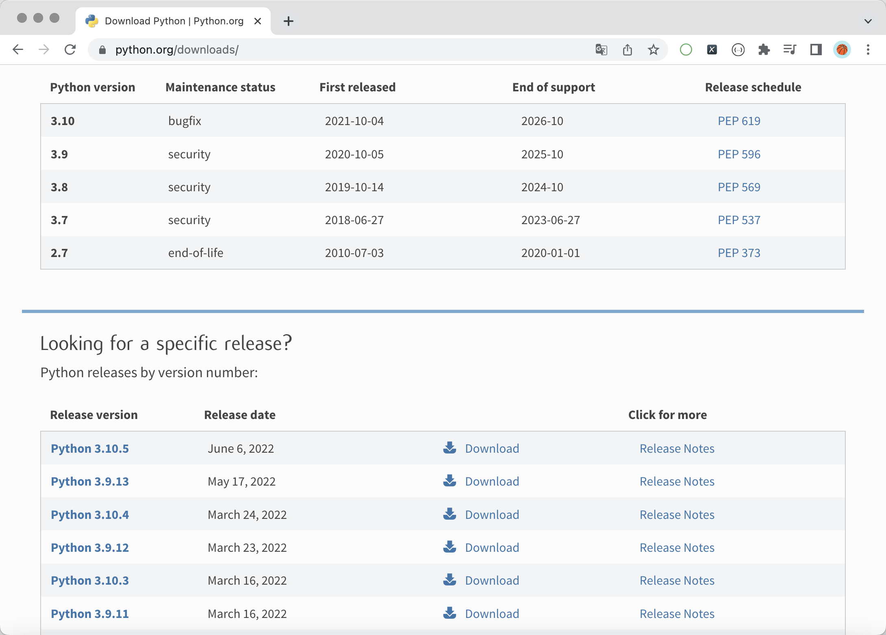
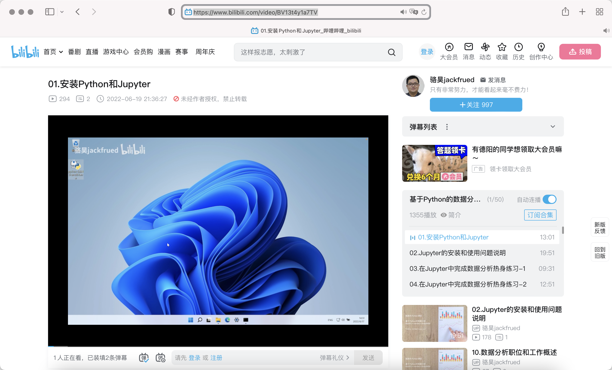
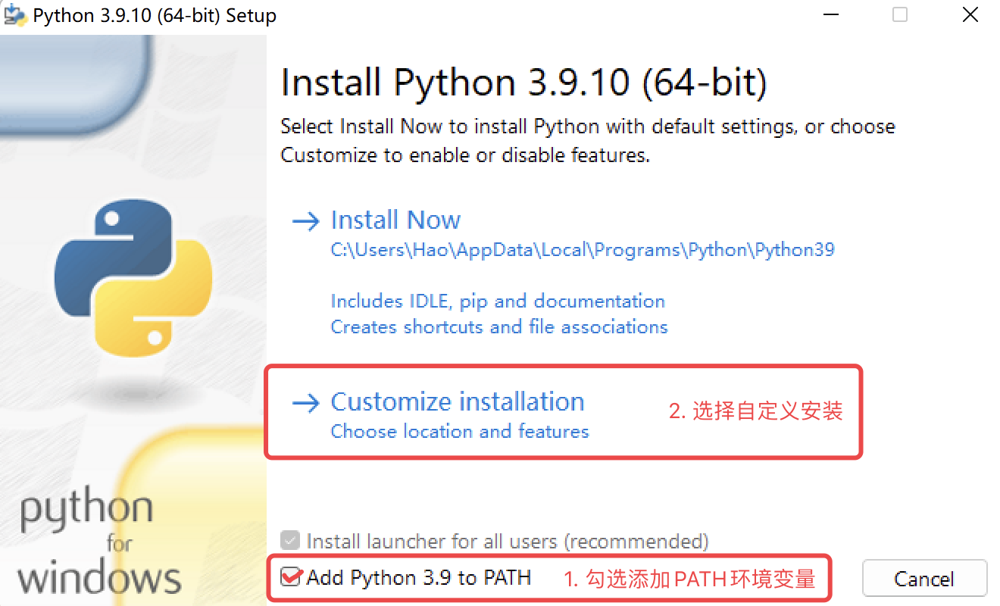
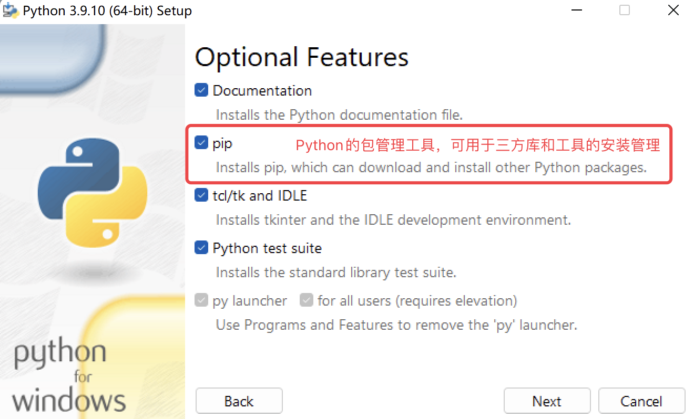
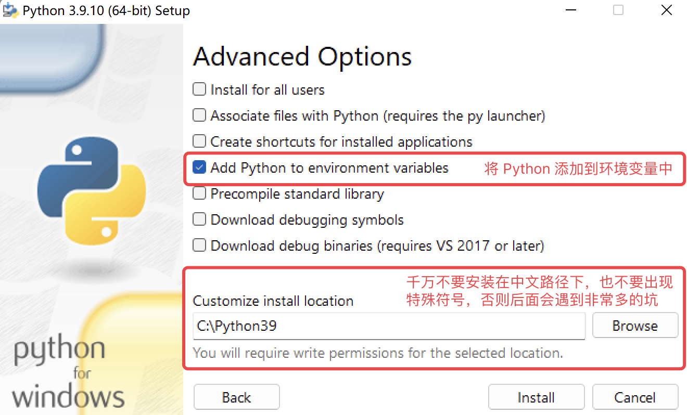
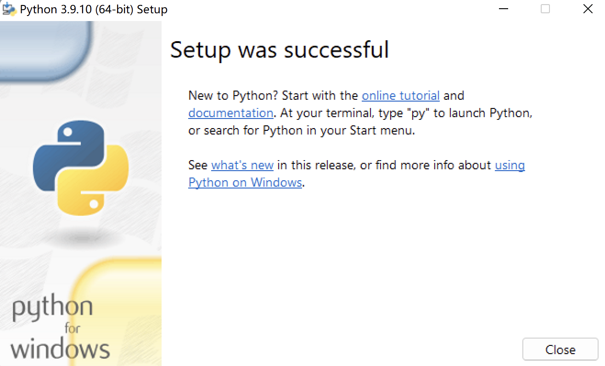
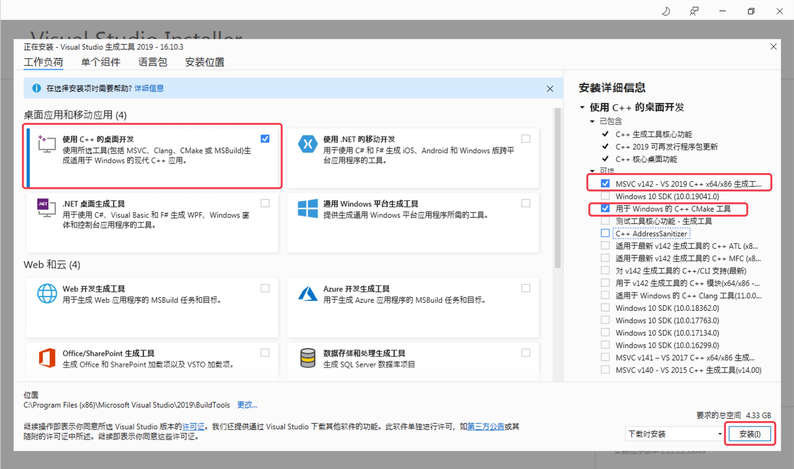
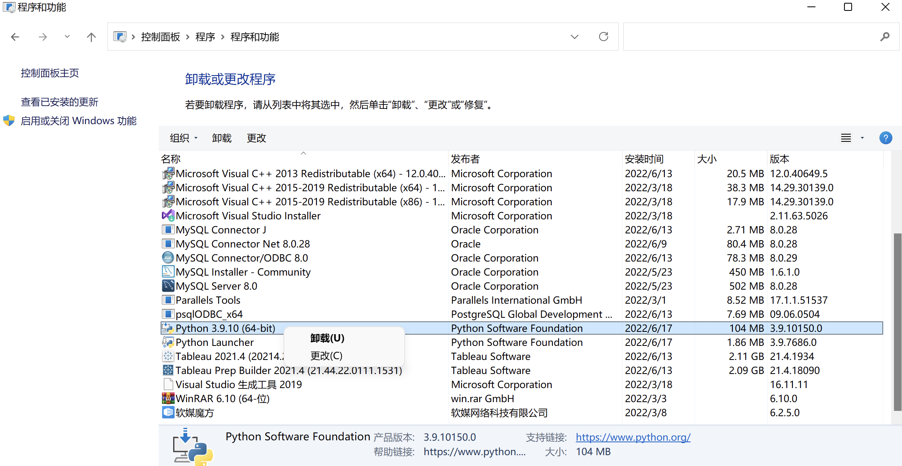
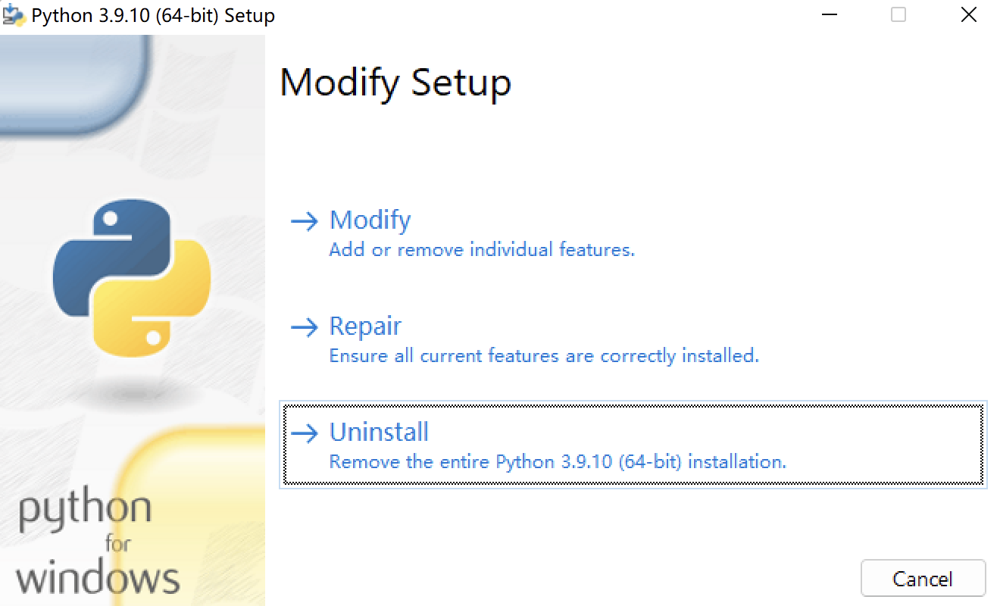

## 背单词学Python系列-01

### 安装环境+小试牛刀

| 单词        | 音标（美式）       | 音标（英式） | 含义                                                     | 说明 |
| ----------- | ------------------ | -------------- | ---------------------------------------------------------- | ----------- |
| python | [ˈpaɪˌθɑn] | [ˈpʌɪθn] | 蟒蛇 | Python 语言的名字源于它的发明者 Guido van Rossum 所挚爱的电视剧 Monty Python's Flying Circus（英国六人喜剧团体巨蟒剧团的电视喜剧系列） |
| interpret   | [ɪnˈtərprət] | [ɪnˈtəːprɪt] | 解释 | Python是一门解释型语言，解释型语言最大的优势是平台可移植性 |
| interpreter | [ɪnˈtərprədər] | [ɪnˈtəːprɪtə] | 解释器 | 运行 Python 程序需要先安装 Python 解释器，官方的 Python 解释器通常称为 CPython，因为它是用 C 语言编写的 |
| compile   | [kəmˈpaɪl] | [kəmˈpʌɪl] | 编译 | 除了解释型语言，还有一类叫编译型语言（C、C++、Go等），编译型语言最大的优势是执行效率更高 |
| compiler  | [kəmˈpaɪlər] | [kəmˈpʌɪlə] | 编译器 | 编译器会将我们编写的程序处理成特定平台的目标代码（二进制文件或中间代码） |
| download | [ˈdaʊnˌloʊd] | [ˈdaʊnləʊd] | 下载 | 可以从官方网站下载 Python 解释器安装程序，如图1所示。 |
| install     | [ɪnˈstɔl]   | [ɪnˈstɔːl] | 安装 | 不会安装 Python 环境的可以看看我录制的视频教程，如图2所示。 |
| customize | [ˈkʌstəmʌɪz] | [ˈkəstəˌmaɪz] | 自定义 | 如果在 Windows 环境下安装官方的 Python 解释器，建议选择“自定义安装”，如图3所示 |
| path | [pæθ] | [pɑːθ] | 路径 | 官方的安装程序会帮助我们配置名为 PATH 的环境变量，这个环境变量确保了我们在命令窗口的任何位置都可以调起 Python 解释器 |
| document | [ˈdɑkjəmənt] | [ˈdɒkjʊm(ə)nt] | 文档 |  |
| package | [ˈpækɪdʒ] | [ˈpakɪdʒ] | 包 | 安装官方的 Python 解释器时，一定要勾选 Python 的包管理工具 pip，如图4所示 |
| environment | [ənˈvaɪrə(n)m(ə)nt] | [ɪnˈvʌɪrə(n)m(ə)nt] | 环境 | |
| variable | [ˈvɛriəb(ə)l] | [ˈvɛːrɪəbl] | 变量 | |
| location | [loʊˈkeɪʃən] | [lə(ʊ)ˈkeɪʃn] | 位置 | 安装 Python 的路径最好只有英文字母和数字，如果使用了如中文、日文、特殊符号等字符，就是给自己挖一个大坑，如图5所示 |
| successful | [səkˈsɛsf(ə)l] | [səkˈsɛsf(ʊ)l] | 成功的 | 官方的安装程序在安装成功时会显示“Setup was successful”，如图6所示 |
| failed | [feɪl] | [feɪl] | 失败的 | 官方的安装程序在安装失败时会显示“Setup was failed”，对于安装失败的情况，通常可以先用“Visual Studio Build Tools”进行修复，如图7所示 |
| uninstall   | [ˌənənˈstɔl]       | [ˌʌnɪnˈstɔːl] | 卸载 | Windows 系统删除 Python 环境可以使用控制面板中的“程序和功能”，如图8所示，也可以通过重新执行 Python 安装程序，选择“Uninstall”来删除已安装的 Python 环境，如图9所示 |
| repair | [rəˈpɛr] | [rɪˈpɛː] | 修复 | 使用官方的安装程序可以进行“修复安装” |
| modify | [ˈmɑdəˌfaɪ] | [ˈmɒdɪfʌɪ] | 修改 | 使用官方的安装程序可以进行“修改安装” |
| print       | [prɪnt]            | [prɪnt] | 打印 | Python 标准库内置函数，可以用于打印一个或多个对象 |
| syntax | [ˈsɪnˌtæks] | [ˈsɪntaks]          | 语法   |                                                              |
| error | [ˈɛrər] | [ˈɛrə]              | 错误   | 如果我们写的代码有语法问题，那么使用 Python 解释器运行代码时就会看到“SyntaxError”的错误提示 |
| invalid | [ˈɪnvələd] | [ˈɪnvəlɪd]          | 无效的 |                                                              |
| character | [ˈkɛr(ə)ktər] | [ˈkarɪktə]          | 字符   | 在程序中使用无效的字符是初学者最容易犯的错误， 例如在不能使用中文的地方使用了中文符号（包括中文的标点符号） |
| comment | [ˈkɑˌmɛnt] | [ˈkɒmɛnt]           | 注释   | 程序中起说明作用的内容，不影响代码的执行结果，Python 中可以使用 # 和 """ 来书写注释，前者是单行注释，后者是多行注释 |

图1：下载官方 Python 解释器安装程序

图2：B站上的 Python 安装视频

图3~图6：Windows 系统安装 Python 解释器

图7：通过“Visual Studio Build Tools”修复环境

图8：通过控制面板卸载 Python

图9：通过安装程序卸载 Python

